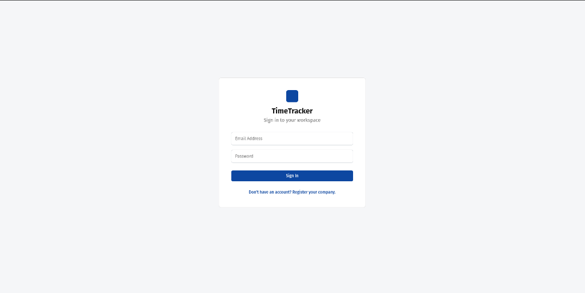
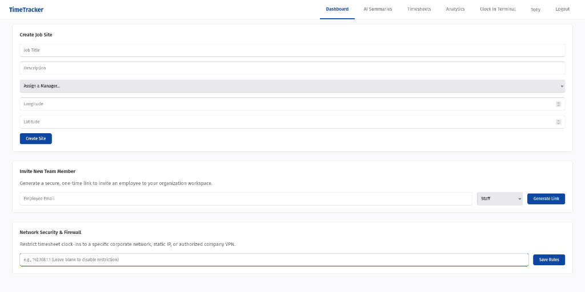
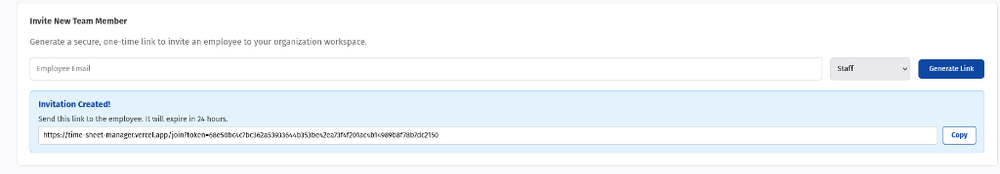

# TimeTracker — Employee Timesheet Management System

A full-stack **MERN** application for managing employee timesheets, job sites, and workforce analytics. Built for companies that need a centralized system to track employee hours, manage job sites, and gain AI-powered insights into workforce patterns.

**Live Demo:** [time-sheet-manager.vercel.app](https://time-sheet-manager.vercel.app/)

---

## Screenshots

<p align="center">
  
  <br/>
  <em>Secure authentication — Sign in, register your company, or join via invite link</em>
</p>

<p align="center">
  
  <br/>
  <em>Manager Dashboard — Create job sites, invite team members, and configure network security</em>
</p>

<p align="center">
  
  <br/>
  <em>One-time secure invitation links with 24-hour expiry for onboarding new employees</em>
</p>

---

## Features

###  Authentication & Multi-Tenancy
- **Company Registration** — Register a new organization and become the Admin
- **JWT Authentication** — Secure token-based auth with role-encoded payloads
- **Magic Invite Links** — Managers generate secure, one-time-use invitation links (24-hour expiry) to onboard employees
- **Multi-Tenant Architecture** — Complete data isolation between organizations

### Role-Based Access Control
Three distinct roles with different permissions:
| Role | Capabilities |
|------|-------------|
| **Admin** | Full access — manage jobs, invite users, configure security settings |
| **Manager** | Create job sites, invite team members, view AI analytics |
| **Staff** | Clock in/out, view personal timesheets |

### Clock In / Clock Out Terminal
- Live stopwatch timer showing elapsed shift duration
- Select employee and job site to start tracking
- Automatic hour calculation on clock-out
- IP-based access restriction for network security

### Analytics & Reporting
- **Team Total Hours** — Bar chart visualization of total hours per employee (Recharts)
- **Daily Breakdown** — Per-employee daily hours chart with employee selector
- **Weekly Overtime Watchlist** — Color-coded progress bars with status badges (`Standard`, `Approaching Overtime`, `Overtime Risk`)
- **Timesheet Log Table** — Complete record of all shifts with member, job site, clock-in/out times, and tracked hours

### AI-Powered Insights (Gemini 2.5 Flash)
- **Weekly Summary** — AI-generated 3-sentence executive summary analyzing workforce trends, top performers, and overtime risks
- **Fraud & Anomaly Detection** — AI scans timesheets for suspicious patterns:
  - Extremely long shifts (>14 hours)
  - Unusual clock-in hours (12 AM – 5 AM)
  - Abandoned shifts (no clock-out after 24 hours)
  - Overlapping shifts for the same employee
  - Unusually short shifts (<30 minutes)
- Severity-tagged alerts (High / Medium / Low)

###  Network Security & Firewall
- Restrict clock-ins to a specific corporate IP / VPN
- Manager-configurable allowedIP per organization
- Real-time IP validation on every clock-in request

---

##  Tech Stack

| Layer | Technology |
|-------|-----------|
| **Frontend** | React 19, Vite 8, Recharts |
| **Backend** | Node.js, Express 5 |
| **Database** | MongoDB Atlas (Mongoose 9) |
| **Auth** | JWT (jsonwebtoken), bcrypt |
| **AI** | Google Gemini 2.5 Flash (`@google/genai`) |
| **Deployment** | Vercel (client), Render (server) |

---

##  Project Structure

```
timesheet/
├── client/                    # React frontend (Vite)
│   ├── src/
│   │   ├── components/
│   │   │   ├── Auth.jsx               # Login, Register, & Invite flows
│   │   │   ├── ManagerDashboard.jsx   # Job creation, invites, IP security
│   │   │   ├── EmployeeDashboard.jsx  # Clock in/out terminal with stopwatch
│   │   │   ├── TimesheetTable.jsx     # Timesheet log table
│   │   │   ├── HoursChart.jsx         # Analytics bar charts (Recharts)
│   │   │   ├── OvertimeWatchlist.jsx   # Weekly overtime progress tracker
│   │   │   └── AISummaries.jsx        # AI weekly summary & anomaly alerts
│   │   ├── hooks/
│   │   │   └── useStopwatch.js        # Custom hook for live elapsed time
│   │   ├── App.jsx                    # Main app with routing & role-based nav
│   │   └── App.css                    # Global styles
│   ├── vercel.json                    # Vercel SPA rewrite config
│   └── package.json
│
├── server/                    # Express backend
│   ├── models/
│   │   ├── User.js                    # User schema (Staff/Manager/Admin)
│   │   ├── Organization.js           # Organization schema with allowedIP
│   │   ├── Job.js                     # Job site schema with geolocation
│   │   ├── Timesheet.js              # Timesheet schema with approval status
│   │   └── Invitation.js             # One-time invite token schema
│   ├── routes/
│   │   ├── authRoutes.js              # Register, login, invite, IP config
│   │   ├── jobRoutes.js               # CRUD for job sites
│   │   ├── timesheetRoutes.js         # Clock in/out & timesheet fetching
│   │   ├── analyticsRoutes.js         # Overtime report, AI summary, anomalies
│   │   └── userRoutes.js              # User listing
│   ├── middleware/
│   │   └── authMiddleware.js          # JWT verification middleware
│   ├── server.js                      # Express app entry point
│   └── package.json
│
├── screenshots/               # App screenshots for README
└── .gitignore
```

---

## Getting Started

### Prerequisites

- **Node.js** v18+
- **MongoDB Atlas** account (or local MongoDB instance)
- **Google Gemini API Key** (for AI features)

### 1. Clone the Repository

```bash
git clone https://github.com/Aryan-814/Time-sheet-manager.git
cd Time-sheet-manager
```

### 2. Backend Setup

```bash
cd server
npm install
```

Create a `.env` file in the `server/` directory:

```env
PORT=5000
MONGO_URI=your_mongodb_connection_string
JWT_SECRET=your_jwt_secret_key
GEMINI_API_KEY=your_google_gemini_api_key
FRONTEND_URL=http://localhost:5173
```

Start the server:

```bash
npm run dev
```

### 3. Frontend Setup

```bash
cd client
npm install
```

Create a `.env` file in the `client/` directory:

```env
VITE_API_BASE_URL=http://localhost:5000/api
```

Start the client:

```bash
npm run dev
```

The app will be running at `http://localhost:5173`.

---

## API Reference

All protected routes require a `Bearer` token in the `Authorization` header.

### Auth
| Method | Endpoint | Description | Auth |
|--------|----------|-------------|------|
| `POST` | `/api/auth/register-company` | Register a new organization & admin | No |
| `POST` | `/api/auth/login` | Login and receive JWT | No |
| `POST` | `/api/auth/invite` | Generate an employee invite link | Yes (Manager+) |
| `POST` | `/api/auth/register-employee` | Register via invite token | No |
| `PUT`  | `/api/auth/organization/ip` | Update allowed IP restriction | Yes (Manager+) |

### Jobs
| Method | Endpoint | Description | Auth |
|--------|----------|-------------|------|
| `POST` | `/api/jobs` | Create a new job site | Yes |
| `GET`  | `/api/jobs` | List all job sites | Yes |

### Timesheets
| Method | Endpoint | Description | Auth |
|--------|----------|-------------|------|
| `POST` | `/api/timesheets/clock-in` | Clock in to a shift | Yes |
| `PUT`  | `/api/timesheets/clock-out/:id` | Clock out of a shift | Yes |
| `GET`  | `/api/timesheets` | Fetch all org timesheets | Yes |

### Analytics
| Method | Endpoint | Description | Auth |
|--------|----------|-------------|------|
| `GET`  | `/api/analytics/overtime` | Weekly overtime report | Yes |
| `GET`  | `/api/analytics/ai-summary` | AI-generated weekly summary | Yes |
| `GET`  | `/api/analytics/ai-anomalies` | AI fraud & anomaly detection | Yes |

---

## Environment Variables

### Server (`server/.env`)
| Variable | Description |
|----------|-------------|
| `PORT` | Server port (default: 5000) |
| `MONGO_URI` | MongoDB Atlas connection string |
| `JWT_SECRET` | Secret key for signing JWTs |
| `GEMINI_API_KEY` | Google Gemini API key for AI features |
| `FRONTEND_URL` | Frontend URL for generating invite links |

### Client (`client/.env`)
| Variable | Description |
|----------|-------------|
| `VITE_API_BASE_URL` | Backend API base URL (e.g., `http://localhost:5000/api`) |

---

## License

This project is open source and available under the [MIT License](LICENSE).
